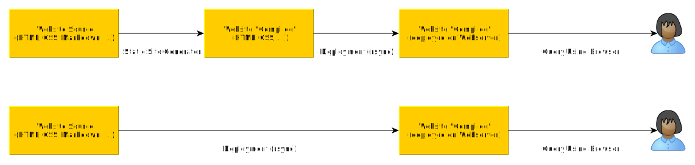

static-markdown-publisher
=========================

[English version (not yet available)](README-en.md)

Einleitung
----------

Ich bin ein ziemlich enthusiastischer Fan von [MDWIKI][MDWIKI].
Das Teil erlaubt mir, Markdown-Dateien zu erstellen und über einen
statischen Webserver zu veröffentlichen, wenn ich noch ein paar
zusätzliche Dateien dort ablege.

Leider wird [MDWIKI][MDWIKI] schon ewig nicht mehr weiterentwickelt
und mir persönlich ist es nicht gelungen, den Build-Prozess erfolgreich
durchzuspielen. Somit kann ich selbst da auch wenig zur Weiterentwicklung
beitragen.

Vor ein paar Wochen bin ich über ein ähnliches Projekt gestolpert:
[RAITO][RAITO]. Das funktioniert quasi genauso wie [MDWIKI][MDWIKI].
Es ist aber deutlich moderner und benötigt keinen Build-Prozess.
Leider ist die Lizenz von [RAITO][RAITO] unklar. Also kann ich
es auch nicht dauerhaft verwenden und muß was eigenes entwickeln.
Ich möchte die [Apache 2.0 License][LICENSE] verwenden, habe aber
noch nicht 100%ig geprüft, ob das rechtlich zulässig ist.

Eine [Tabelle der Lizenzen von Drittsoftware][LICENSE-OTHERS]
findet sich [hier][LICENSE-OTHERS].

Ziele
-----

Grob betrachtet möchte ich sowas ähnliches wie MDWIKI nachbauen, also

- ich erstelle ein paar Rahmendateien wie "index.html", "config.js" etc
- ... und dazu eine Reihe von MD-Dateien
- ... und all das kann auf einem Webserver hinterlegt und dann direkt
  per Browser gesichtet werden

Die Anzahl der Rahmendateien sollte sich dabei "in Grenzen" halten - maximal
10 Stück oder so. Der Inhalt und die Anzahl der MD-Dateien sollen komplett
variabel sein.

Abgrenzung zu "Static Site Generatoren"
---------------------------------------

Bei "Static Site Generatoren" ist der Ausgangspunkt der Quelltext
der Website. Er besteht aus:

- HTML-Dateien
- CSS-Dateien
- Markdown-Dateien
- uvm.

Der "Static Site Generator" verarbeitet all diese Dateien und
erzeugt daraus einen neuen Satz an Dateien, die dann auf einem
Webserver ausgerollt werden können. Oftmals werden bei der
Verarbeitung u.a. die Markdown-Dateien gewandelt in HTML-Dateien.

Mein "static-markdown-publisher" kommt ohne diesen Verarbeitungsschritt
aus. Der Quelltext der Website kann direkt auf dem Webserver ausgerollt
werden.

Implementierungs- und Aufbau-Schritte
-------------------------------------

* [Schritt 1 - Grundlegendes HTML-Dokument](step-01_basic-html/README.md)
* [Schritt 2 - HTML-Dokument mit Javascript](step-02_html-with-javascript/README.md)
* [Schritt 3 - Zusatzdaten von externer Datei](step-03_external-file/README.md)
* [Schritt 4 - Komplette Seite von externer Datei](step-04_complete-page/README.md)
* [Schritt 5 - Markdown](step-05_markdown/README.md)
* [Schritt 6 - Mehrere Markdown-Dateien](step-06_multi-markdown/README.md)
* [Schritt 7 - Links zwischen Markdown-Dateien](step-07_markdown-links/README.md)
* [Schritt 8 - Kopf und Fuß](step-08_header-and-footer/README.md)
* [Schritt 9 - Styling](step-09_styling/README.md)
* [Schritt 10 - Unterordner](step-10_subfolders/README.md)
* [Schritt 11 - Bilder in Markdown-Dateien](step-11_images/README.md)
* [Schritt 12 - Kontextpfad /smp](step-12_smp/README.md)
* [Schritt 13 - Diverse Link-Typen und Links zu externen Resourcen](step-13_enhanced-links/README.md)
* [Schritt 14 - Syntaxhervorhebung mit "highlight.js"](step-14_highlightjs/README.md)
* [Schritt 15 - Javascript in Markdown-Dateien](step-15_script-tag/README.md)
* [Schritt 16 - Stuttgart-Styling](step-16_stuttgart-styling/README.md)
* [Schritt 17 - Konfigurationsdatei "config.js"](step-17_config-js/README.md)
* [Schritt 18 - Styling der Randabstände](step-18_styling-padding/README.md)
* [Schritt 19 - Styling der Tabellen](step-19_styling-tables/README.md)
* [Schritt 20 - Menüzeile](step-20_navbar/README.md)
* [Schritt 21 - Klebende Menü- und Fußzeile](step-21_sticky-navbar/README.md)
* [Schritt 22 - Links-Rechts-Menüzeile](step-22_left-right-navbar/README.md)
* [Schritt 23 - Hübschere DIFFs](step-23_diff2htmljs/README.md)
* [Schritt 24 - Diagramme mit Mermaid.js](step-24_mermaidjs/README.md)
* [Schritt 25 - Syntaxhervorhebung mit "prism.js"](step-25_prismjs/README.md)
* [Schritt 26 - Haupt-Kopf aufblenden](step-26_header-on-off/README.md)
* [Schritt 27 - Mehrsprachigkeit](step-27_languages/README.md)
* [Schritt 28 - Links-Rechts-Menüzeile NG](step-28_left-right-navbar-ng/README.md)
* [Schritt 29 - Unterordner und Links](step-29_subfolders-and-links/README.md)
* [Schritt 30 - Initialseite](step-30_welcome-page/README.md)
* [Schritt 31 - Aktualisierungen bei der Konfigurationsdatei](step-31_config-js-update/README.md)
* [Schritt 32 - Optionale Syntaxhervorhebung mit "prism.js"](step-32_optional-prismjs/README.md)
* [Schritt 33 - Graphiken mit "chart.js"](step-33_chartjs/README.md)
* [Schritt 34 - Mehrsprachigkeit für Markdown, Html und Text](step-34_languages-ng/README.md)

Endergebnis
-----------

[Finale Version](final/)

Test und Github-Pages
---------------------

"Normale" HTML-Dateien kann man
einfach direkt im Webbrowser sichten, bspw. mittels dem
Aufruf `firefox index.html`. Leider funktioniert
dies nicht, sobald zusätzliche Dateien nachgeladen werden sollen.

### Lokale Tests ohne externe Abhängigkeiten

- Dummy-HTTP-Server starten

    - `python -m http.server 8000 -d step-03_external-file`
    - `python3 -m http.server 8000 -d step-03_external-file`

- Browser starten mit [http://localhost:8000][LOCALHOST]

- Nachteil: Man muß den Dummy-HTTP-Server im Auge behalten

### Tests mittels Github-Pages

- Browser starten mit <https://uli-heller.github.io/static-markdown-publisher/step-03_external-file/index.html>
- Nachteile:
    - Geht nur mit Internet-Zugriff
    - Geht nur, wenn ich den Zweig "gh-pages" synchron zu "main" halte
    - Für Github-Forks oder bei Umzug des Repos laufen die Links in's Leere

[MDWIKI]: http://www.mdwiki.info/
[RAITO]: https://github.com/arnaudsm/raito/
[LICENSE]: LICENSE.md
[LICENSE-OTHERS]: LICENSE-OTHERS.md
[LOCALHOST]: http://localhost:8000
