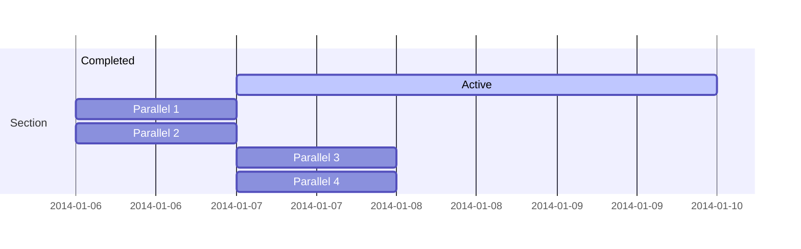

24 - Mermaid.js
===============

[Zurück zur Übersicht][MAIN]

Ziel
----

[Mermaid.js][MERMAID] ist in der Lage,
Graphiken aus CodeBlöcken "hübsch" darzustellen.

Hier ein Beispiel:



Änderungen
----------

Grob sind diese Änderungen erforderlich:

- index.html
    - mermaid.min.js laden
    - codeRenderer erweitern um 'mermaid'
    - Aufruf von 'mermaid.init()' nachdem das Dokument geladen ist
- stuttgart.css
    - Zeichensatz für 'mermaid' festlegen

Hier die Änderungen im Detail:

```diff
diff --git a/step-24_mermaidjs/index.html b/step-24_mermaidjs/index.html
index 44014ca..362c6ff 100644
--- a/step-24_mermaidjs/index.html
+++ b/step-24_mermaidjs/index.html
@@ -21,6 +21,9 @@
   <link rel="stylesheet" type="text/css" href="https://cdn.jsdelivr.net/npm/diff2html/bundles/css/diff2html.min.css">
   <script type="text/javascript" src="https://cdn.jsdelivr.net/npm/diff2html/bundles/js/diff2html.min.js"></script>
 
+  <!-- mermaid.js -->
+  <script type="text/javascript" src="https://cdn.jsdelivr.net/npm/mermaid/dist/mermaid.min.js"></script>
+
   <script src="config.js"></script>
   <script>
     function nodeScriptIs(node) {
@@ -84,6 +87,8 @@
     renderer.code = (code, infostring, escaped) => {
         if (infostring === 'diff') {
             return Diff2Html.html(code);
+       } else if (infostring === 'mermaid') {
+           return '<div class="mermaid">' + code + '</div>';
         }
         return originalRendererCode(code, infostring, escaped);
     };
@@ -148,6 +153,7 @@
         if (isNavbar) {
             handleNavbar(element);
         }
+       mermaid.init(undefined, ".mermaid");
     }
 
     /*
diff --git a/step-24_mermaidjs/stuttgart.css b/step-24_mermaidjs/stuttgart.css
index 62e6ceb..9fbe0b9 100644
--- a/step-24_mermaidjs/stuttgart.css
+++ b/step-24_mermaidjs/stuttgart.css
@@ -133,3 +133,7 @@ body {
 #middle tr:last-child td:last-child {
     border-bottom-right-radius: 5px;
 }
+
+div.mermaid {
+    font-family: 'trebuchet ms', verdana, arial;
+}
```

[MAIN]:    ../README.md
[MERMAID]: https://github.com/mermaid-js/mermaid
