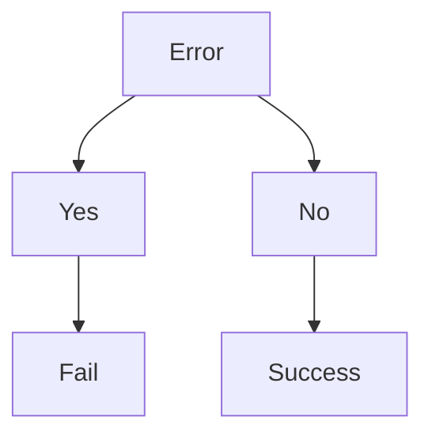

# 24 - Prism.js

Dies ist eine Markdown-Datei
mit einem Block für Syntaxhervorhebungen:

```shell
#!/bin/bash
LOG=y

log () {
  test -n "${LOG}" && echo "$(date +%Y-%m-%s_%H:%M:%S) - " "$@"
}
```

Hier noch eine CSV-"Datei":

```csv
name,alter,groesse
uli,56,178
ernie,65,32
```

Hier ein Mermaid-Absatz:


