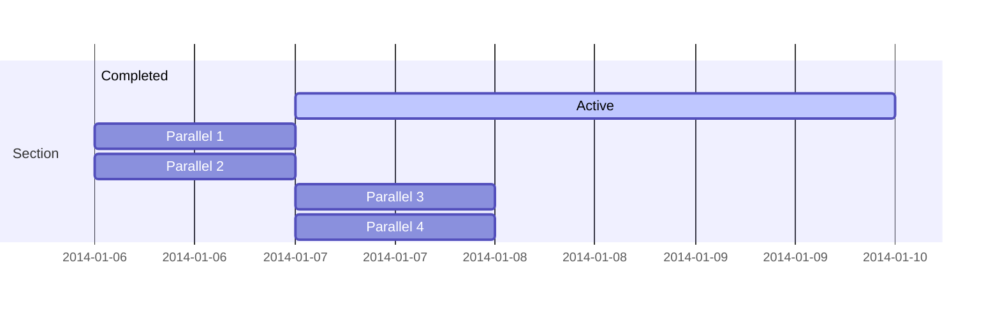
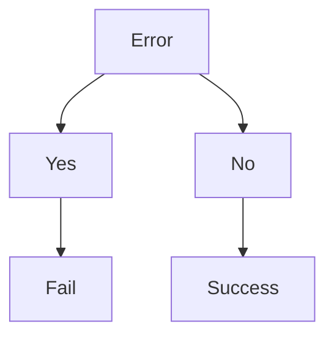

SMP - static-markdown-publisher
===============================

Komponenten
-----------

Diese Dateien sind notwendig, damit der SMP funktioniert:

- index.html ... enthält die Implementierng vom SMP
- config.js ... Konfigurationsdatei für den SMP

Notwendige Dateien, die umbenannt werden können:

- index.md
- header.md
- footer.md
- navbar.md
- stuttgart.css
- stuttgart.svg

Showcase
--------

### Markdown

Die meisten Markdown-Konstrukte funktionieren.
SMP basiert auf [marked.js][MARKED]. Somit können alle
Markdown-Konstrukte verwendet werden, die [marked.js][MARKED]
versteht.

#### Liste

```markdown
- eins
- zwei
- drei
```

- eins
- zwei
- drei

#### Aufzählung

```markdown
1. eins
1. zwei
1. drei
```

1. eins
1. zwei
1. drei

#### Tabelle

```markdown
Tabelle | Spalte 2 | Spalte 3
--------|----------|---------
1       |1.2       |1.3
2       |2.2       |2.3
3       |3.2       |3.3
```

Tabelle | Spalte 2 | Spalte 3
--------|----------|---------
1       |1.2       |1.3
2       |2.2       |2.3
3       |3.2       |3.3

#### Formatierung

```markdown
Zeichenformatierungen *schräg*, **fett**, ...
```

Zeichenformatierungen *schräg*, **fett**, ...

#### Syntax-Hervorhebung

````markdown
```shell
#!/bin/bash

for i in 1 2 3; do
  echo $i
  sleep $i
done
```
````

```shell
#!/bin/bash

for i in 1 2 3; do
  echo $i
  sleep $i
done
```

#### Diff

````markdown
```diff
diff -wur original/config.js erweitert/config.js
--- original/config.js  2024-03-29 10:52:49.327284029 +0100
+++ erweitert/config.js 2024-03-30 07:17:06.609444326 +0100
@@ -5,12 +5,12 @@
         { filename: "footer.md", elementId: "footermd", insertBeforeElementId: "bottomid", isNavbar: true },
     ],
     javascripts: [
-        "prism-1.26.0.js",
+        "prism-1.29.0.js",
         "tabulator-6.1.min.js",    // Auskommentieren für HTML-Tabellen
     ],
     stylesheets: [
         "stuttgart.css",
-        "prism-1.26.0.css",
+        "prism-1.29.0.css",
         "tabulator-6.1.min.css",   // Auskommentieren für HTML-Tabellen
     ],
     multiLanguage: false,
```
````

```diff
diff -wur original/config.js erweitert/config.js
--- original/config.js  2024-03-29 10:52:49.327284029 +0100
+++ erweitert/config.js 2024-03-30 07:17:06.609444326 +0100
@@ -5,12 +5,12 @@
         { filename: "footer.md", elementId: "footermd", insertBeforeElementId: "bottomid", isNavbar: true },
     ],
     javascripts: [
-        "prism-1.26.0.js",
+        "prism-1.29.0.js",
         "tabulator-6.1.min.js",    // Auskommentieren für HTML-Tabellen
     ],
     stylesheets: [
         "stuttgart.css",
-        "prism-1.26.0.css",
+        "prism-1.29.0.css",
         "tabulator-6.1.min.css",   // Auskommentieren für HTML-Tabellen
     ],
     multiLanguage: false,
```

#### Mermaid-Grafiken

````markdown
Erstes Beispiel:



Zweites Beispiel:


````

Erstes Beispiel:


Zweites Beispiel:


[MARKED]:     https://marked.js.org