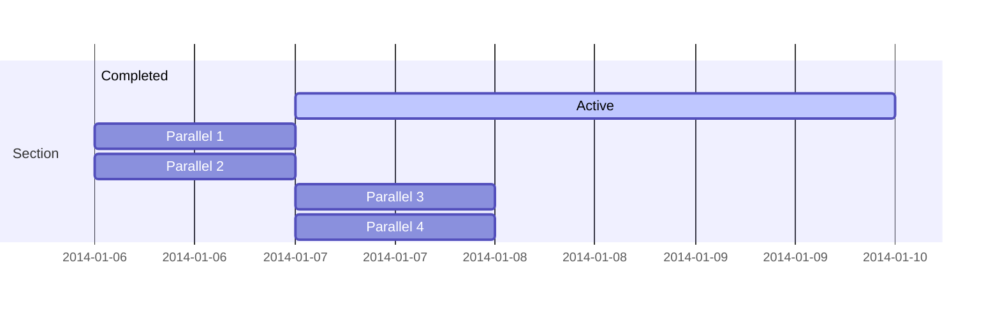
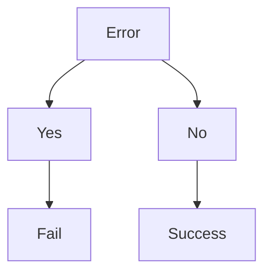

Diagramme mit Mermaid.js
========================

Hier ein Beispiel:

```mermaid
gantt
section Section
Completed :done,    des1, 2014-01-06,2014-01-08
Active        :active,  des2, 2014-01-07, 3d
Parallel 1   :         des3, after des1, 1d
Parallel 2   :         des4, after des1, 1d
Parallel 3   :         des5, after des3, 1d
Parallel 4   :         des6, after des4, 1d
```

Und ein zweites:

```mermaid
graph TD;
  Error-->Yes;
  Error-->No;
  Yes-->Fail;
  No-->Success;
```
